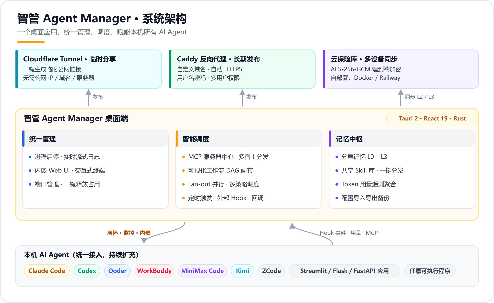
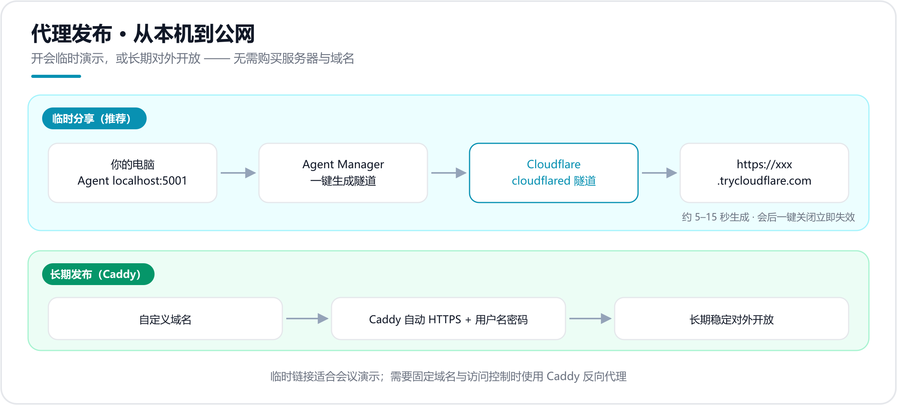
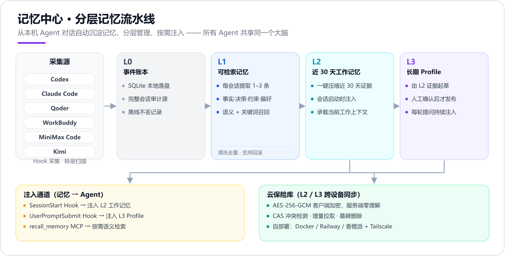

# 智管-Agent Manager

<p align="center">
  
</p>

<p align="right"><a href="./README_EN.md">English</a></p>


[](https://github.com/Zafer-Liu/Agent_Manager/stargazers)
[](https://github.com/Zafer-Liu/Agent_Manager/actions)
[](#)
[](https://tauri.app)
[](https://react.dev)
[](https://www.rust-lang.org)

> 本地 AI Agent 的统一管理中心。
> 添加 Agent 后，用户可在这里实现：
>
> - 一键启动 / 停止，实时查看日志，内嵌 Web UI 与交互式终端
> - 跨 Agent 分层记忆：所有 Agent 共享同一个大脑
> - 一键生成临时公网分享链接

<p align="center">
  <a href="#features">✨ 项目亮点</a> ·
  <a href="#recommended-agents">🤝 推荐搭配</a> ·
  <a href="#install">⚙️ 快速安装</a> ·
  <a href="#quickstart">🚀 快速上手</a> ·
  <a href="#llm-config">🤖 LLM 配置</a> ·
  <a href="#memory">🧬 记忆中心</a> ·
  <a href="#share">🌐 分享 Agent</a> ·
  <a href="#faq">❓ FAQ</a>
</p>

<details>
<summary><strong>📚 完整目录</strong></summary>

<br>

- [项目亮点](#features)
- [推荐搭配 Agent](#recommended-agents)
- [核心功能](#capabilities)
  - [Agent 管理](#agents)
  - [MCP 服务器中心](#mcp)
  - [代理发布与临时分享](#share)
  - [Port Manager 端口管理](#ports)
  - [记忆中心 跨 Agent 分层记忆](#memory)
- [安装方式](#install)
- [快速上手](#quickstart)
- [LLM 配置说明](#llm-config)
- [支持的项目类型](#project-types)
- [数据存储路径](#data-paths)
- [版本更新](#roadmap)
- [FAQ](#faq)
- [参与贡献](#contributing)
- [License](#license)

</details>

---

<a id="features"></a>

# ✨ 项目亮点

**智管-Agent Manager** 是一个基于 Tauri 2 + React 19 + Rust 的桌面应用，专门解决"本机跑了一堆 AI Agent，管理混乱"的问题。

核心理念：**所有 Agent，一个窗口管到底。**

<p align="center">
  
</p>

- 不用开多个终端，不用记各种启动命令
- 不用手动打开浏览器找端口
- 用自然语言就能操控所有 Agent
- 让所有编码 Agent 共享同一份分层记忆与 Skill 库
- 开会时一键把 Agent 发布到公网演示

---
<a id="recommended-agents"></a>

# 🤝 推荐搭配 Agent

智管-Agent Manager 可以统一管理本地运行的各类 AI Agent。
如果你正在寻找一个适合被智管托管的业务型 Agent，推荐搭配使用：

<details>
<summary><strong>📊 智能商业分析 Agent</strong></summary>

<br>

**智能商业分析 Agent** 是一个面向商业数据分析场景的 AI Agent。
上传 Excel / CSV，或连接数据库后，用户可以直接用自然语言提问，系统会自动完成：

* 数据结构识别
* SQL 生成与执行
* 图表推荐与生成
* 业务洞察分析
* Excel / Word / PPT 报告导出

配合智管-Agent Manager 使用后，可以获得更完整的桌面端体验：

| 使用场景         | 智管-Agent Manager 提供的能力      |
| ------------ | --------------------------- |
| 启动商业分析 Agent | 一键启动 / 停止进程                 |
| 查看运行状态       | 实时日志、PID、端口状态               |
| 打开分析界面       | 内嵌 Web UI，无需切换浏览器           |
| 团队临时演示       | 一键生成 Cloudflare Tunnel 公网链接 |
| 多 Agent 协作   | 可视化工作流编排 · 定时 / 外部触发     |

👉 项目地址：[智能商业分析 Agent](https://github.com/Zafer-Liu/Data-Analysis-Agent)

</details>

---
<a id="capabilities"></a>

# 🧠 核心功能

<a id="agents"></a>

## 1️⃣ Agent 管理

### 自动识别项目类型

选择项目目录后，自动检测并填写启动命令，无需手动填写。详见[支持的项目类型](#project-types)。

### 启动与监控

- 一键启动 / 停止 Agent 进程
- 实时流式日志（stdout + stderr），支持自动滚动
- 查看 PID、端口状态、启动时间
- 侧边栏支持拖拽排序

### 内嵌 Web UI

有 Web 界面的 Agent（如 Streamlit、Flask、FastAPI）可以直接在应用内打开，不用切换浏览器：

- 多标签页同时打开多个 Agent UI
- 标签栏高度可拖拽调整
- 支持一键全屏
- 支持 WebSocket Token 自动填充（openclaw 类型 Agent）

---

<a id="mcp"></a>

## 2️⃣ MCP 服务器中心 — 统一管理与分发

集中管理本机 MCP 服务器：既是**工作流可调用的运行时配置**，也是**分发到各 Agent 宿主的目录**。

**本地服务器管理：**

- **本地扫描**：自动检测 npm 全局安装的 MCP 包
- **智能解析**：粘贴任意文本（官方文档、安装说明等），AI 自动提取配置
- **手动添加**：填写 stdio / SSE 配置
- 添加的服务器供[可视化工作流](#roadmap)直接调用

**目录与分发：**

- 常用 MCP 服务器集中保存为目录条目，按需一键安装到 Claude Code、Claude Desktop、Codex CLI、Codex Desktop、Qoder、WorkBuddy、MiniMax Code、Kimi、ZCode 等宿主
- 从各 Agent 现有配置一键导入，安装状态实时可视（已安装 / 配置不一致）

---

<a id="share"></a>

## 3️⃣ 代理发布 — 临时分享与公网访问

无需固定 IP，无需域名，无需服务器，两条路径把本机 Agent 发布到公网：

<p align="center">
  
</p>

### 🔗 临时分享（推荐 · 适合开会场景）


一键生成临时公网链接：

```
你的电脑 localhost:5001
        ↓ Cloudflare Tunnel
https://abc-xyz.trycloudflare.com  ← 发给同事
```

**使用流程：**

1. 安装 cloudflared（见下方）
2. 确认 Agent 已启动
3. 在"代理发布"页找到目标 Agent → 点击 **生成链接**
4. 等待约 5–15 秒，出现 `https://xxx.trycloudflare.com`
5. 复制链接发给同事
6. 会后点 **关闭**，链接立即失效

**安装 cloudflared：**

```powershell
# Windows（推荐用 Scoop）
scoop install cloudflared

# macOS
brew install cloudflared
```

或从 [GitHub Releases](https://github.com/cloudflare/cloudflared/releases/latest) 直接下载 exe。

> ⚠️ 临时链接无访问控制，请仅在需要时开启，会后立即关闭。

### 🛡️ Caddy 反向代理（长期发布）

适合需要固定域名、持续开放访问的场景：

- 绑定自定义域名（自动申请 HTTPS 证书）
- 用户名 / 密码访问控制（bcrypt 加密存储）
- 多用户权限精细管理（每条规则可独立设置允许哪些用户访问）
- 一键生成 Caddyfile + 启动/重载 Caddy

---

<a id="ports"></a>

## 4️⃣ Port Manager — 端口管理


查看当前机器上所有正在监听的端口：

- 显示端口号、协议、PID、进程名
- 一键终止占用指定端口的进程
- 方便排查 Agent 启动失败（端口被占用）的问题

---

<a id="memory"></a>

## 5️⃣ 记忆中心 — 跨 Agent 分层记忆

让所有 Agent 记住你的偏好、决策与当前进展。记忆中心从本机编码 Agent 的对话中自动提取记忆，分层管理、按需注入——**所有 Agent 共享同一个大脑**。

<p align="center">
  
</p>

### 🧬 四层记忆模型（L0–L3）

| 层级 | 名称 | 来源 | 作用 |
|------|------|------|------|
| L0 | 事件账本 | Hook 事件 / 本地转录扫描原文 | 审计源，整体从不注入 |
| L1 | 可检索记忆 | 每次会话结束自动提取 1–3 条事实 / 决策 / 约束 / 偏好 | 语义 + 关键词按需召回 |
| L2 | 近 30 天工作记忆 | 一键压缩近 30 天 L1 证据 | 会话启动时注入当前工作上下文 |
| L3 | 长期 Profile | 基于 L2 起草，人工确认后才发布 | 每轮提问注入稳定的长期偏好与约束 |

### 📥 自动沉淀（Agent → 记忆）

- 支持 **Codex、Claude Code、Qoder、WorkBuddy、MiniMax Code、Kimi**，Hook 采集或本地转录扫描两种方式
- 会话先落盘本地 SQLite 账本再异步提取——离线、模型未配置都不丢采集记录，可稍后手动重跑
- 「待提取记忆」「已整理对话」面板可随时回看完整对话、查看提取进度与失败原因
- L1 清洗与去重：本地 BGE 语义候选 + LLM 裁决，带可回滚检查点

### ✍️ 自定义记忆

- 在「近 30 天工作记忆」或「长期 Profile」卡片下手写补充记忆，**两层相互独立**，各自展示、编辑、删除
- 随整理与注入自动下发给 Agent；只有用户能删改，自动清洗不会碰它们

### 💉 记忆注入（记忆 → Agent，双通道）

| 通道 | 机制 | 适用场景 |
|------|------|----------|
| Hook 自动注入 | SessionStart 仅注入 L2 近 30 天记忆；UserPromptSubmit 每轮仅注入 L3 长期记忆 | 开局获取工作背景，后续轮次持续遵循长期偏好 |
| 共享记忆 MCP | Agent 按需调用 `recall_memory` 语义检索 | 只取任务相关记忆，控制上下文体积 |

**一键接入：** 记忆中心可为 **Claude Code、Claude Desktop、Codex CLI、Codex Desktop、Qoder、WorkBuddy、MiniMax Code、Kimi、ZCode** 九个宿主一键安装 / 卸载共享记忆 MCP，并为 Claude Code、Codex、Qoder、WorkBuddy 四个支持 Hook 的 Agent 管理采集与注入 Hook；数据目录支持按设备自定义。

### ☁️ 云保险库 — 跨设备同步（可选）

- 同步范围：L2 / L3 已发布文档 + 用户自定义记忆，多台设备共享同一份大脑
- **AES-256-GCM 端到端加密**：密钥派生自同步密码、不落盘，服务端只存密文、对内容零理解
- CAS 冲突检测、增量拉取、墓碑删除；本地 SQLite 永远权威，云端不可达不影响注入
- 服务端单文件部署，开源在 [`vault/`](vault/README.md)：支持 Docker / Railway / 香橙派 + Tailscale 自建

### 📊 Token 用量与共享 Skill 库

- **用量统计**：聚合各 Agent 本机转录的真实输入 / 输出 / 缓存用量，口径与供应商计费对齐
- **Skill 库**：扫描各 Agent 的 `SKILL.md` 汇入共享库，按内容哈希预览新增 / 更新 / 冲突后确认同步；「发布 + 装备」一步完成，支持批量操作与各 Agent 版本漂移检测

> 外部系统接入与遥测端点格式见[遥测与外部接入](#telemetry)。

---

<a id="install"></a>

# ⚙️ 安装方式

### 下载预构建安装包（推荐）

从 [Releases](https://github.com/Zafer-Liu/Agent_Manager/releases) 下载最新版本（当前提供 Windows x64 安装包，macOS 支持即将到来）。

双击安装包，按提示安装即可。

### 从源码构建

**前置依赖：**

- [Node.js](https://nodejs.org) ≥ 18
- [Rust](https://rustup.rs)（stable）
- [Tauri 前置依赖](https://tauri.app/start/prerequisites/)（Windows 需要 VS C++ 生成工具）

```bash
git clone https://github.com/Zafer-Liu/Agent_Manager.git
cd Agent_Manager

# 安装依赖
npm install
cd frontend && npm install && cd ..

# 开发模式运行
npm run dev

# 生产构建
npm run build
```

构建产物在 `src-tauri/target/release/bundle/` 下。

---

<a id="quickstart"></a>

# 🚀 快速上手

## 第一步：添加 Agent

1. 侧边栏点击 **Agents** → 右上角 **＋ New Agent**
2. 点击 📁 选择 Agent 的项目目录（或切换到「从 GitHub 安装」直接拉取仓库）
3. 应用自动识别项目类型，填写启动命令
4. 填写名称，确认端口号（有 Web UI 的 Agent 需要）→ **保存**
5. 点击 ▶ 启动

## 第二步：查看 Agent 界面

- 有 Web UI 的 Agent（Streamlit / Flask 等）：点击 **Open UI** → 在应用内嵌标签页打开
- TUI 类 Agent（Claude Code 等）：点击 **Open Terminal** → 在应用内嵌终端打开

## 第三步：开启记忆中心（可选）

1. 在 **设置 → LLM 与记忆提取** 中确认记忆提取模型（可选 Ollama 本地模型）
2. 打开 **记忆中心** → 在「自动沉淀」中为 Codex / Claude Code 等安装 Hook
3. 正常使用各 Agent，会话记忆自动沉淀；在「近 30 天工作记忆」「长期 Profile」卡片一键生成并注入

## 第四步：开会时分享 Agent（可选）

1. 安装 cloudflared
2. 打开**代理发布**页面
3. 找到目标 Agent → **生成链接** → 复制发送

---

<a id="llm-config"></a>

# 🤖 LLM 配置说明

MCP 分发与记忆提取都依赖 LLM。在 **设置 → LLM 与记忆提取** 中添加：

| 字段 | 说明 | 示例 |
|------|------|------|
| 名称 | 自定义，随便填 | DeepSeek |
| Base URL | OpenAI 兼容的 API 地址 | `https://api.deepseek.com/v1` |
| API Key | 对应的 API Key | `sk-xxx` |
| 模型 | 模型名称 | `deepseek-chat` |

点击**测试连接**，显示绿色即配置成功。

**内置支持的提供商：**

| 提供商 | Base URL | 推荐模型 |
|--------|----------|---------|
| DeepSeek | `https://api.deepseek.com/v1` | `deepseek-chat` |
| OpenAI | `https://api.openai.com/v1` | `gpt-4o-mini` |
| 任意兼容 API | 自定义 | 自定义 |

**本地模型（Ollama）：**

LLM 设置页内置 **Ollama 本地模型** 模块：

1. 确认本机 Ollama 已启动（默认 `http://localhost:11434`，可修改）
2. 点击 **测试连接**，自动列出已拉取的本地模型（参数规模 / 量化 / 体积）
3. 对目标模型点 **接入**，自动添加到自定义提供商列表，可直接测试或设为记忆提取模型

---

<a id="project-types"></a>

# 🔍 支持的项目类型

选择项目目录后，自动检测并填写以下配置：

| 项目类型 | 识别条件 | 自动生成的命令 |
|---------|---------|--------------|
| Python · uv | `pyproject.toml` + `uv.lock` | `uv run python main.py` |
| Python · FastAPI | requirements 含 `fastapi` | `uvicorn main:app --reload --port PORT` |
| Python · Django | `manage.py` 存在 | `python manage.py runserver 0.0.0.0:8000` |
| Python · Streamlit | requirements 含 `streamlit` | `streamlit run app.py --server.port 8501` |
| Python · Flask | requirements 含 `flask` | `python app.py` |
| Python · 通用 | `main.py` / `app.py` 等 | `python main.py` |
| Node.js | `package.json` | `npm run dev` |
| Rust | `Cargo.toml` | `cargo run` |
| Go | `go.mod` | `go run .` |
| npm 全局命令 | `%APPDATA%\npm\*.cmd` | 交互式 PowerShell + 自动输入命令 |
| 可执行文件 | `.exe` / `.bat` / `.cmd` / `.sh` | 直接运行 |

端口号也会自动检测：扫描 `.env` 文件、`pyproject.toml` 脚本、源码中的 `port=` 配置。

---

<a id="data-paths"></a>

# 📁 数据存储路径

| 数据 | Windows | macOS |
|------|---------|-------|
| Agent 配置 | `%APPDATA%\agent-manager\agents.json` | `~/Library/Application Support/agent-manager/agents.json` |
| LLM 提供商 | `%APPDATA%\agent-manager\llm_config.json` | 同左 |
| 代理 / 用户配置 | `%APPDATA%\agent-manager\proxy.json` | 同左 |
| 记忆与遥测数据库 | `%APPDATA%\agent-manager\telemetry.sqlite3` | 同左 |
| Agent 数据源目录覆盖 | `%APPDATA%\agent-manager\agent_source_paths.json` | 同左 |
| 生成的 Caddyfile | `%APPDATA%\agent-manager\Caddyfile` | 同左 |
| MCP 服务器配置 | `%APPDATA%\Claude\claude_desktop_config.json` | `~/Library/Application Support/Claude/claude_desktop_config.json` |

「设置」页支持一键**导出 / 导入配置备份**，方便迁移与灾难恢复。

---

<a id="telemetry"></a>

# 🔌 遥测与外部接入（实验性）

记忆流水线以本地 SQLite 作为事件账本：Hook 事件先落盘，再异步抽取为记忆，因此记忆服务离线不会丢失采集记录。

- **Codex、Claude Code、Qoder**：可在记忆中心分别安装 / 卸载本机 Hook；端口和鉴权跟随「外部触发」配置
- **WorkBuddy**：不写入其 Claude Code 配置，避免重复采集；可通过标准遥测端点提交已聚合的会话 / 用量数据
- **Token 口径**：Codex、Claude、WorkBuddy 从本机转录读取真实用量；Qoder、MiniMax Code、Kimi 当前转录未提供完整供应商 usage 的部分，显示明确标记的本地估算。所有 Agent 的零散 Hook 事件只保留审计记录，不会重复累计；适配器可用 `session_usage` 以真实最终值覆盖估算

标准遥测端点：`POST http://127.0.0.1:<hook-port>/telemetry/events/{codex|workbuddy|claude|qoder}`。

```json
{
  "session_id": "stable-session-id",
  "event": "session_usage",
  "cwd": "D:/Github-repo/example",
  "usage": { "input_tokens": 120, "output_tokens": 48, "cached_tokens": 60 },
  "usage_scope": "session"
}
```

`input_tokens` 必须是该会话完整输入总量，`cached_tokens` 仅作缓存命中明细展示（不要再加到 `input_tokens` 或 Token 总量）。同一 `source + session_id` 后续重报会覆盖先前值，而非叠加。

---

<a id="roadmap"></a>

# 🗺️ 版本更新

> **当前版本 `v1.0.0 Beta`**

## v1.0.0 Beta 主要更新

**🧬 记忆中心 — 跨 Agent 分层记忆（本版本核心）**

- ✅ **L0–L3 四层记忆模型**：事件账本 → 可检索记忆 → 近 30 天工作记忆 → 长期 Profile（人工发布闸门，草案可编辑）
- ✅ **自动沉淀**：支持 Codex、Claude Code、Qoder、WorkBuddy、MiniMax Code、Kimi，Hook 采集 + 本地转录扫描双通道；SQLite 账本先落盘，离线不丢记录
- ✅ **双通道注入**：SessionStart 注入 L2、UserPromptSubmit 每轮注入 L3；共享记忆 MCP `recall_memory` 按需语义检索
- ✅ **共享记忆 MCP 一键接入九大宿主**：Claude Code / Claude Desktop / Codex CLI / Codex Desktop / Qoder / WorkBuddy / MiniMax Code / Kimi / ZCode
- ✅ **记忆清洗与去重**：本地 BGE 语义候选分块生成 + LLM 裁决预算自适应，回滚检查点保证删除安全
- ✅ **独立管理面板**：待提取记忆、已整理对话、记忆注入（双向视图 + 审计摘要回放）
- ✅ **云保险库**：L2 / L3 与自定义记忆跨设备同步，AES-256-GCM 端到端加密，自部署服务端（[vault/](vault/README.md)，支持 Docker / Railway / 香橙派）
- ✅ **共享 Skill 库**：扫描各 Agent `SKILL.md`，「发布 + 装备」一步完成，批量操作 + 版本漂移检测
- ✅ **Token 用量统计**：从本机转录读取真实输入 / 输出 / 缓存用量，口径与供应商计费对齐

**⚙️ 管理与体验**

- ✅ **Ollama 本地模型接入**：自动列出已拉取模型，一键接入为自定义提供商或记忆提取模型
- ✅ **MCP 服务器中心**：MCP 服务器目录统一管理与多宿主一键分发
- ✅ **配置导入导出备份**：一键迁移与恢复
- ✅ **从 GitHub 安装 Agent**：填入仓库地址自动拉取并填充配置

📖 [查看完整 Changelog](https://github.com/Zafer-Liu/Agent_Manager/releases)

---

## v0.3.0 主要更新

**阶段四：外部协作能力**

- ✅ **本地 Hook Server**：默认 `127.0.0.1:9420`，外部系统通过 HTTP 推任务进 Agent Manager，端口和 auth_token 可配置
- ✅ **agent_task 节点**：工作流可调度本地/远程子 Agent，oneshot channel 挂起等待结果
- ✅ **Callback 出站通知**：Run 终态时回调外部 URL，指数退避重试 3 次
- ✅ **Fan-out 并行执行**：static / by_field / llm_split 拆分策略，`join_all` 并行执行子任务
- ✅ **DispatchStrategy 调度策略**：Fixed / Failover / CapabilityMatch / Random 四种策略
- ✅ **定时触发（cron）**：自建 5 字段 cron 解析器，后台线程每分钟检查模板 schedule 字段
- ✅ **McpTransport Http 变体**：支持远程 MCP Server（Streamable HTTP transport）
- ✅ **前端 SVG DAG 画布**：支持拖拽定位和工具栏
- ✅ **ExternalTriggers 设置页**、运行历史来源列、工作流验收面板、Sweeper 自愈巡检、FailureTrace 诊断链路、Metrics 事件源

📖 [查看完整 Changelog](https://github.com/Zafer-Liu/Agent_Manager/releases)

---

## v0.2.3 主要更新

- ✅ 可视化工作流：拖拽组合 MCP 工具、LLM 与完整 MCP Agent 节点，支持流式步骤反馈
- ✅ MCP Agent 增强：对话中启用多个 MCP Server，工具调用过程可折叠查看
- ✅ MCP 智能配置：本地目录扫描、JSON / README / 命令文本 AI 解析及 stdio / SSE 配置
- ✅ 中英文界面：完整 i18n 与语言切换
- ✅ 持续集成：Push、Pull Request 和正式发布前自动执行前端检查与 Rust 测试

📖 [查看完整 Changelog](https://github.com/Zafer-Liu/Agent_Manager/releases)

---

<a id="faq"></a>

# ❓ FAQ

<details>
<summary><b>🧬 记忆中心相关</b></summary>

<br>

<details>
<summary><b>会话一直没有被提取成记忆？</b></summary>

按顺序检查：

1. 记忆提取依赖 LLM：确认 **设置 → LLM 与记忆提取** 中至少有一个测试通过的提供商（或已接入 Ollama 本地模型）
2. 打开 **记忆中心 → 待提取记忆** 面板，查看会话是否在队列中、失败原因是什么
3. 确认对应 Agent 的 Hook 已安装（采集方式显示「Hook 已安装」），或其转录目录配置正确（本地转录扫描型 Agent 依赖目录探测）
4. 失败的会话可在面板中手动重跑

</details>

<details>
<summary><b>L3 长期 Profile 修改后没生效？</b></summary>

L3 采用「草案 → 人工发布」闸门：由 L2 起草的草案必须点击 **确认发布** 才会注入；已发布的 L3 也可以直接编辑，保存后立即生效。若通过 MCP 检索不到新内容，确认宿主的共享记忆 MCP 处于已连接状态。

</details>

<details>
<summary><b>云保险库同步冲突了怎么办？</b></summary>

本地 SQLite 永远是权威数据，云端不可达不影响注入。同步冲突时应用会弹出对话框，由你选择保留哪一侧版本；服务端只存 AES-256-GCM 密文，无法读取或篡改内容。

</details>

</details>

---

<details>
<summary><b>📦 Agent 管理相关</b></summary>

<br>

<details>
<summary><b>Agent 启动后状态显示"错误"？</b></summary>

查看 Agent 详情页的日志，通常是：

- 端口被占用：在 Port Manager 找到占用该端口的进程并终止
- 依赖未安装：在终端手动运行一次启动命令，查看具体报错
- 工作目录不对：确认 Agent 配置中的工作目录路径正确

</details>

<details>
<summary><b>Agent 有 Web UI 但打开后是空白？</b></summary>

Agent 可能还在启动中（端口尚未监听）。等待几秒后，点击 UI 面板工具栏的刷新按钮。

</details>

<details>
<summary><b>Claude Code 终端打开后是空白？</b></summary>

这是正常现象。应用会自动启动 PowerShell，然后等待约 800ms 后向 stdin 写入 `claude` 命令。稍等 1–2 秒，Claude Code 的 TUI 界面会渲染出来。

</details>

<details>
<summary><b>Python Agent 识别出的命令不对？</b></summary>

自动识别基于文件扫描，边缘情况可能判断有误。在 Agent 编辑界面手动修改命令和参数即可，修改后保存立即生效。

</details>

<details>
<summary><b>Agent 列表顺序能调整吗？</b></summary>

可以。在 Agents 页面，按住 Agent 左侧的拖动把手（悬停后出现的 ⠿ 图标），拖拽到目标位置即可。顺序自动保存。

</details>

</details>

---

<details>
<summary><b>🌐 代理发布相关</b></summary>

<br>

<details>
<summary><b>点击"生成链接"后一直没有 URL 出现？</b></summary>

可能原因：

1. cloudflared 未安装或不在 PATH 中 → 点击"重新检测"按钮，确认路径已识别
2. 网络问题 → cloudflared 需要能访问 Cloudflare，确认没有代理或防火墙拦截
3. Agent 未启动 → 临时链接会转发到本机端口，Agent 需处于运行状态

</details>

<details>
<summary><b>同事打开链接显示"无法访问此网站"？</b></summary>

确认：

1. Agent 在你本机正在运行（不是停止状态）
2. 隧道还没有关闭（应用里还显示绿色 URL）
3. 链接是完整的 `https://xxx.trycloudflare.com` 格式

</details>

<details>
<summary><b>多个同事同时访问对话内容混在一起？</b></summary>

这是 Agent 本身的限制，对话历史存在 Agent 进程的内存里，Agent Manager 无法从外部隔离。

如需隔离，需在 Agent 代码中加 session 支持（如 Streamlit 使用 `st.session_state` 天然隔离）。

</details>

<details>
<summary><b>Caddy 找不到 / proxy_apply 失败？</b></summary>

安装 Caddy：

```powershell
# Windows
scoop install caddy

# macOS
brew install caddy
```

安装后在代理发布页点击刷新按钮。

</details>

</details>

---

<details>
<summary><b>⚙️ 安装与运行相关</b></summary>

<br>

<details>
<summary><b>Windows 安装包提示"未知发布者"？</b></summary>

点击"更多信息" → "仍要运行"。这是因为安装包未经过 Microsoft 代码签名，属于正常现象。

</details>

<details>
<summary><b>macOS 提示"无法打开，因为无法验证开发者"？</b></summary>

在终端执行：

```bash
xattr -d com.apple.quarantine /Applications/智管-Agent\ Manager.app
```

或右键点击应用 → 选择"打开" → 再次点击"打开"。

</details>

<details>
<summary><b>开发模式 npm run dev 报端口占用？</b></summary>

本项目开发端口为 **1420**（避免与 Mindmap 等 Vite 项目的 5173 冲突）。如 1420 被占用：

```powershell
# 查找占用进程
netstat -ano | findstr :1420
# 终止该进程（把 PID 替换为实际值）
taskkill /PID <PID> /F
```

</details>

</details>

---

<a id="contributing"></a>

# 🤝 参与贡献

欢迎提交 PR 或 Issue！参与方式：

1. **Fork** 本仓库
2. 创建特性分支 (`git checkout -b feature/amazing-feature`)
3. 提交更改 (`git commit -m 'feat: add amazing feature'`)
4. 推送到分支 (`git push origin feature/amazing-feature`)
5. 提交 **Pull Request**

Bug 报告或功能建议请通过 [Issues](https://github.com/Zafer-Liu/Agent_Manager/issues) 提交。开发环境搭建详见[从源码构建](#install)。

---

<a id="license"></a>

# 📄 License

[Apache 2.0](LICENSE)

---

# ⭐ 项目目标

把所有 Agent 的管理交给智管，把时间留给真正重要的事。
