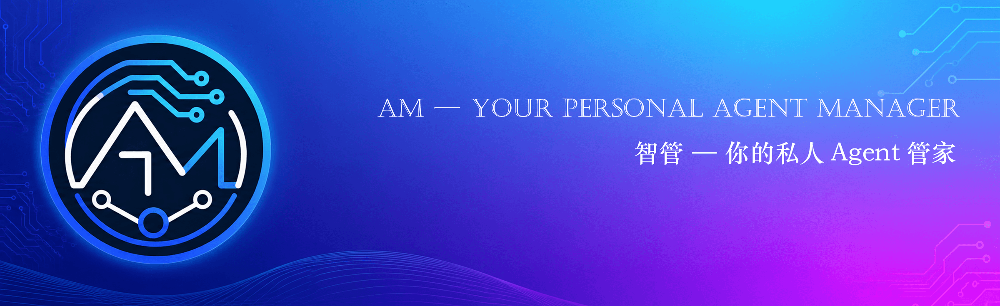
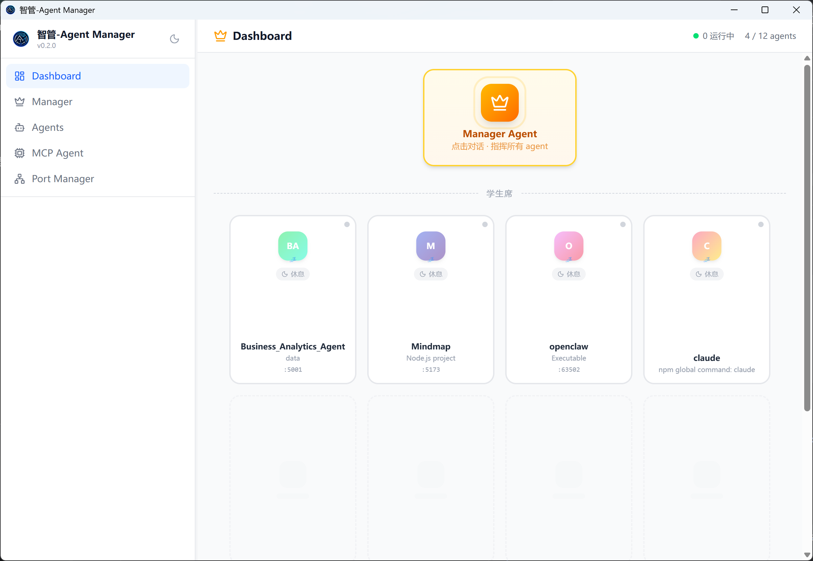
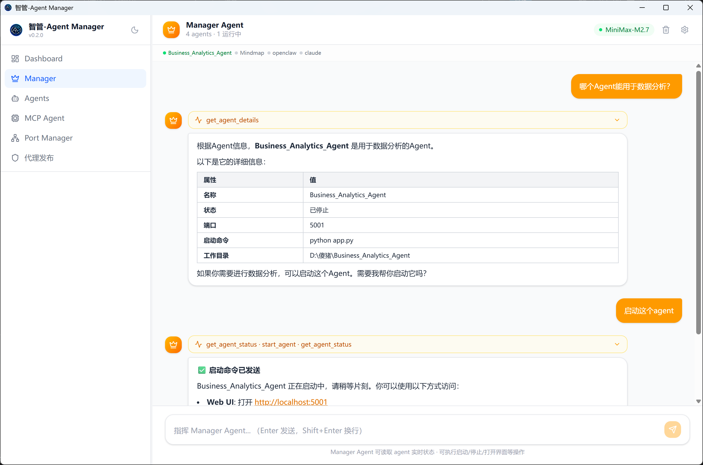
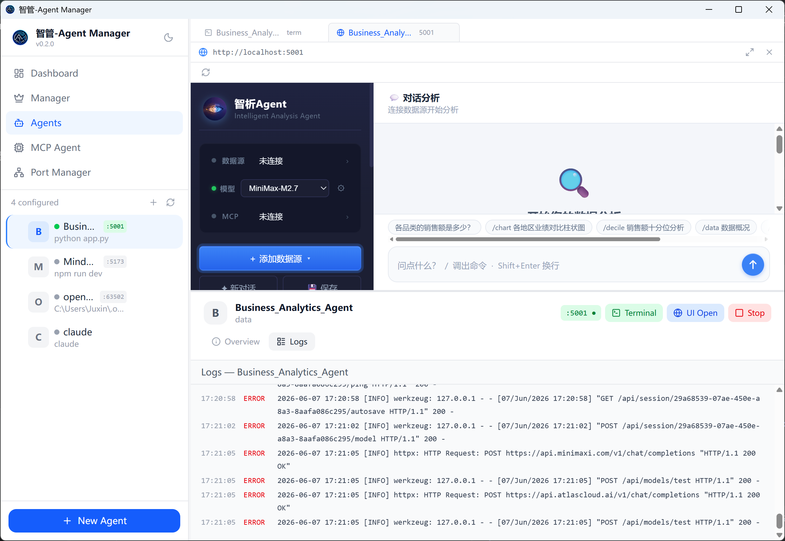
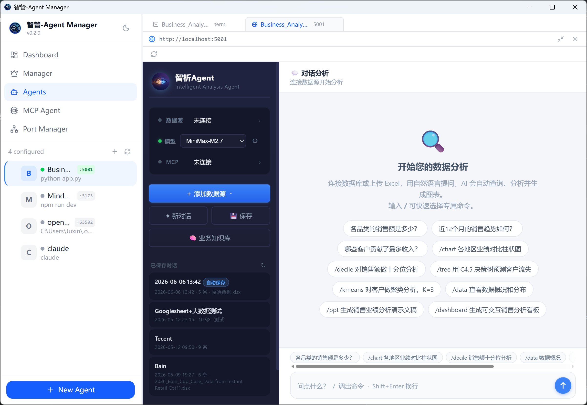
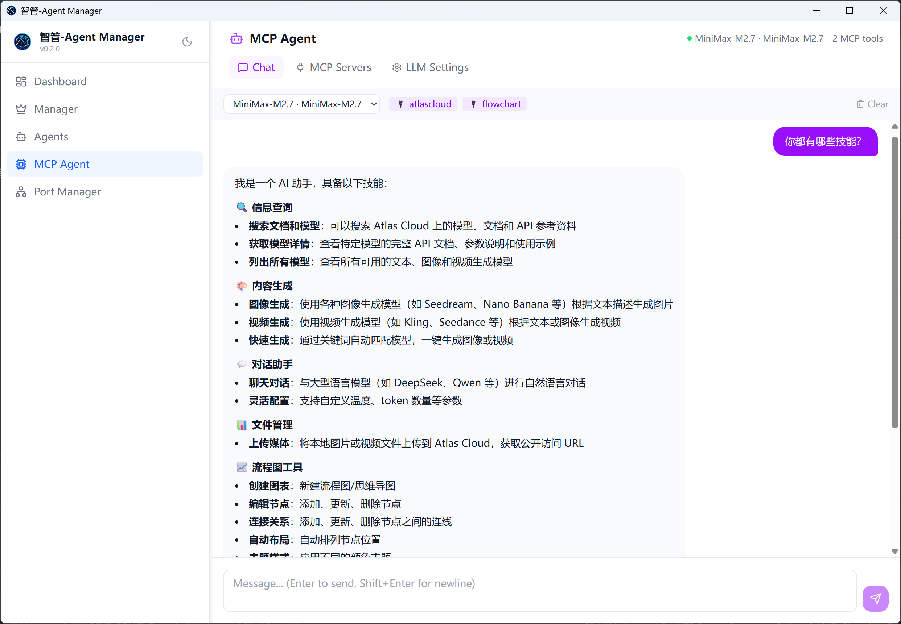
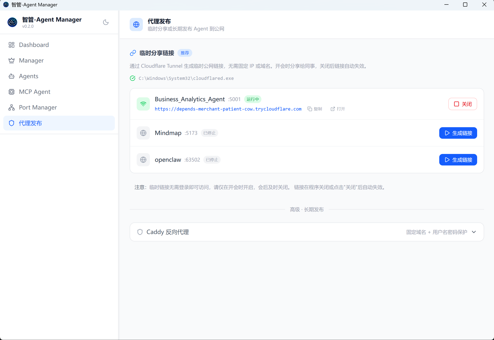
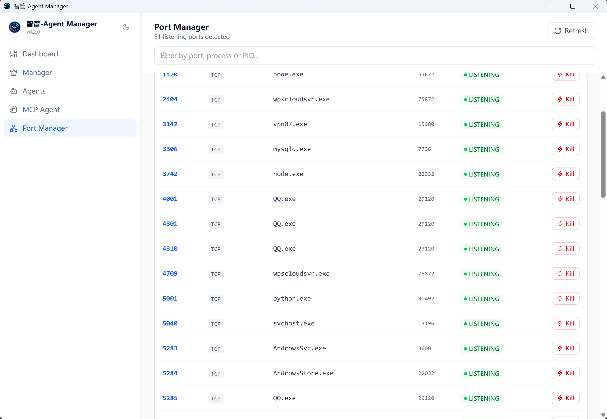

# 智管-Agent Manager

<p align="center">
  
</p>

<p align="right"><a href="./README_EN.md">English</a></p>


[](https://github.com/Zafer-Liu/Agent_Manager/stargazers)
[](https://github.com/Zafer-Liu/Agent_Manager/actions)
[](#)
[](https://tauri.app)
[](https://react.dev)
[](https://www.rust-lang.org)

> 本地 AI Agent 的统一管理中心。  
> 添加 Agent 后，用户可在这里实现：
>
> - 一键启动 / 停止，实时查看日志
> - 内嵌 Web UI 与交互式终端
> - 用自然语言指挥所有 Agent
> - 一键生成临时公网分享链接

<p align="center">
  <a href="#features">✨ 项目亮点</a> ·
  <a href="#recommended-agents">🤝 推荐搭配</a> ·
  <a href="#install">⚙️ 快速安装</a> ·
  <a href="#quickstart">🚀 快速上手</a> ·
  <a href="#llm-config">🤖 LLM 配置</a> ·
  <a href="#share">🌐 分享 Agent</a> ·
  <a href="#faq">❓ FAQ</a>
</p>

<details>
<summary><strong>📚 完整目录</strong></summary>

<br>

- [项目亮点](#features)
- [核心功能](#capabilities)
  - [Dashboard 教室视图](#dashboard)
  - [Manager Agent 自然语言指挥官](#manager)
  - [Agent 管理](#agents)
  - [MCP Agent 工具对话](#mcp)
  - [代理发布与临时分享](#share)
  - [Port Manager 端口管理](#ports)
- [安装方式](#install)
- [快速上手](#quickstart)
- [LLM 配置说明](#llm-config)
- [支持的项目类型](#project-types)
- [数据存储路径](#data-paths)
- [版本更新](#roadmap)
- [FAQ](#faq)
- [参与贡献](#contributing)
- [License](#license)

</details>

---

<a id="features"></a>

# ✨ 项目亮点

**智管-Agent Manager** 是一个基于 Tauri 2 + React 19 的桌面应用，专门解决"本机跑了一堆 AI Agent，管理混乱"的问题。

核心理念：**所有 Agent，一个窗口管到底。**

- 不用开多个终端
- 不用记各种启动命令
- 不用手动打开浏览器找端口
- 用自然语言就能操控所有 Agent

---
<a id="recommended-agents"></a>

# 🤝 推荐搭配 Agent

智管-Agent Manager 可以统一管理本地运行的各类 AI Agent。
如果你正在寻找一个适合被智管托管的业务型 Agent，推荐搭配使用：

<details>
<summary><strong>📊 智能商业分析 Agent</strong></summary>

<br>

**智能商业分析 Agent** 是一个面向商业数据分析场景的 AI Agent。
上传 Excel / CSV，或连接数据库后，用户可以直接用自然语言提问，系统会自动完成：

* 数据结构识别
* SQL 生成与执行
* 图表推荐与生成
* 业务洞察分析
* Excel / Word / PPT 报告导出

配合智管-Agent Manager 使用后，可以获得更完整的桌面端体验：

| 使用场景         | 智管-Agent Manager 提供的能力      |
| ------------ | --------------------------- |
| 启动商业分析 Agent | 一键启动 / 停止进程                 |
| 查看运行状态       | 实时日志、PID、端口状态               |
| 打开分析界面       | 内嵌 Web UI，无需切换浏览器           |
| 团队临时演示       | 一键生成 Cloudflare Tunnel 公网链接 |
| 多 Agent 协作   | 使用 Manager Agent 自然语言调度     |

```text
示例：
帮我启动 Business Analytics Agent，然后打开它的界面
```

👉 项目地址：[智能商业分析 Agent](https://github.com/Zafer-Liu/Data-Analysis-Agent)

</details>

---
<a id="capabilities"></a>

# 🧠 核心功能

<a id="dashboard"></a>

## 1️⃣ Dashboard — 教室视图

所有 Agent 以可视化展示：**Manager Agent 在讲台**，其他 Agent 坐在学生座位上。



一眼看清所有 Agent 的状态，悬停在 Agent 座位上，可直接：
- 启动 / 停止
- 查看详情
- 打开 UI 界面

点击讲台的 Manager Agent，直接跳转到自然语言指挥界面。

---

## 2️⃣ Manager Agent — 自然语言指挥官

用一句话控制所有 Agent，无需手动操作界面。



```text
帮我启动 Business Analytics Agent，然后打开它的界面
```

```text
把 Mindmap 停掉，顺便告诉我它是干什么的
```

```text
现在有哪些 Agent 在运行？
```

Manager Agent 会理解意图 → 自动调用工具 → 完成操作，并向你汇报结果。

**支持的操作：**

| 自然语言描述 | 实际行为 |
|------------|---------|
| 启动 / 停止某个 Agent | 调用 start/stop 接口 |
| 打开某个 Agent 的界面 | 自动在标签栏打开 UI |
| 打开某个 Agent 的终端 | 自动在标签栏打开 PTY 终端 |
| 查看所有 Agent 状态 | 返回实时状态汇总表 |
| 了解某个 Agent 的功能 | 读取该 Agent 目录下的 README |
| 跳转到某个页面 | 自动导航 |

**会话持久化：** 切换到其他页面再回来，对话历史不丢失。

> 需要配置 LLM 提供商才能使用，详见 [LLM 配置说明](#llm-config)。

---

<a id="agents"></a>

## 3️⃣ Agent 管理

### 自动识别项目类型

选择项目目录后，自动检测并填写启动命令，无需手动填写。详见[支持的项目类型](#project-types)。

### 启动与监控

- 一键启动 / 停止 Agent 进程
- 实时流式日志（stdout + stderr），支持自动滚动
- 查看 PID、端口状态、启动时间
- 侧边栏支持拖拽排序

### 内嵌 Web UI

有 Web 界面的 Agent（如 Streamlit、Flask、FastAPI）可以直接在应用内打开，不用切换浏览器：

- 多标签页同时打开多个 Agent UI
- 标签栏高度可拖拽调整
- 支持一键全屏
- 支持 WebSocket Token 自动填充（openclaw 类型 Agent）


---

<a id="mcp"></a>

## 4️⃣ MCP Agent — AI 工具对话



通过 MCP（Model Context Protocol）连接本地工具服务，与 AI 进行多轮工具调用对话。

**MCP 服务器添加方式：**

- **本地扫描**：自动检测 npm 全局安装的 MCP 包
- **智能解析**：粘贴任意文本（官方文档、安装说明等），AI 自动提取配置
- **手动添加**：填写 stdio / SSE 配置

---

<a id="share"></a>

## 5️⃣ 代理发布 — 临时分享与公网访问

### 🔗 临时分享（推荐 · 适合开会场景）


无需固定 IP，无需域名，无需服务器。一键生成临时公网链接：

```
你的电脑 localhost:5001
        ↓ Cloudflare Tunnel
https://abc-xyz.trycloudflare.com  ← 发给同事
```

**使用流程：**

1. 安装 cloudflared（见下方）
2. 确认 Agent 已启动
3. 在"代理发布"页找到目标 Agent → 点击 **生成链接**
4. 等待约 5–15 秒，出现 `https://xxx.trycloudflare.com`
5. 复制链接发给同事
6. 会后点 **关闭**，链接立即失效

**安装 cloudflared：**

```powershell
# Windows（推荐用 Scoop）
scoop install cloudflared

# macOS
brew install cloudflared
```

或从 [GitHub Releases](https://github.com/cloudflare/cloudflared/releases/latest) 直接下载 exe。

> ⚠️ 临时链接无访问控制，请仅在需要时开启，会后立即关闭。

### 🛡️ Caddy 反向代理（长期发布）

适合需要固定域名、持续开放访问的场景：

- 绑定自定义域名（自动申请 HTTPS 证书）
- 用户名 / 密码访问控制（bcrypt 加密存储）
- 多用户权限精细管理（每条规则可独立设置允许哪些用户访问）
- 一键生成 Caddyfile + 启动/重载 Caddy

---

<a id="ports"></a>

## 6️⃣ Port Manager — 端口管理


查看当前机器上所有正在监听的端口：

- 显示端口号、协议、PID、进程名
- 一键终止占用指定端口的进程
- 方便排查 Agent 启动失败（端口被占用）的问题

---

<a id="install"></a>

# ⚙️ 安装方式

### 下载预构建安装包（推荐）

从 [Releases](https://github.com/Zafer-Liu/Agent_Manager/releases) 下载最新版本：


双击安装包，按提示安装即可。

### 从源码构建

**前置依赖：**

- [Node.js](https://nodejs.org) ≥ 18
- [Rust](https://rustup.rs)（stable）
- [Tauri 前置依赖](https://tauri.app/start/prerequisites/)（Windows 需要 VS C++ 生成工具）

```bash
git clone https://github.com/Zafer-Liu/Agent_Manager.git
cd Agent_Manager

# 安装依赖
npm install
cd frontend && npm install && cd ..

# 开发模式运行
npm run dev

# 生产构建
npm run build
```

构建产物在 `src-tauri/target/release/bundle/` 下。

---

<a id="quickstart"></a>

# 🚀 快速上手

## 第一步：添加 Agent

1. 侧边栏点击 **Agents** → 右上角 **＋ New Agent**
2. 点击 📁 选择 Agent 的项目目录
3. 应用自动识别项目类型，填写启动命令
4. 填写名称，确认端口号（有 Web UI 的 Agent 需要）→ **保存**
5. 点击 ▶ 启动

## 第二步：查看 Agent 界面

- 有 Web UI 的 Agent（Streamlit / Flask 等）：点击 **Open UI** → 在应用内嵌标签页打开
- TUI 类 Agent（Claude Code 等）：点击 **Open Terminal** → 在应用内嵌终端打开

## 第三步：使用 Manager Agent（可选）

1. 在 **MCP Agent → LLM 设置** 中添加 LLM 提供商（见[LLM 配置说明](#llm-config)）
2. 点击侧边栏 **Manager**
3. 选择 LLM 提供商
4. 用自然语言发送指令

## 第四步：开会时分享 Agent（可选）

1. 安装 cloudflared
2. 打开**代理发布**页面
3. 找到目标 Agent → **生成链接** → 复制发送

---

<a id="llm-config"></a>

# 🤖 LLM 配置说明

Manager Agent 和 MCP Agent 都需要 LLM 驱动。在 **MCP Agent → LLM 设置** 中添加：

| 字段 | 说明 | 示例 |
|------|------|------|
| 名称 | 自定义，随便填 | DeepSeek |
| Base URL | OpenAI 兼容的 API 地址 | `https://api.deepseek.com/v1` |
| API Key | 对应的 API Key | `sk-xxx` |
| 模型 | 模型名称 | `deepseek-chat` |

点击**测试连接**，显示绿色即配置成功。

**内置支持的提供商：**

| 提供商 | Base URL | 推荐模型 |
|--------|----------|---------|
| DeepSeek | `https://api.deepseek.com/v1` | `deepseek-chat` |
| OpenAI | `https://api.openai.com/v1` | `gpt-4o-mini` |
| 任意兼容 API | 自定义 | 自定义 |

---

<a id="project-types"></a>

# 🔍 支持的项目类型

选择项目目录后，自动检测并填写以下配置：

| 项目类型 | 识别条件 | 自动生成的命令 |
|---------|---------|--------------|
| Python · uv | `pyproject.toml` + `uv.lock` | `uv run python main.py` |
| Python · FastAPI | requirements 含 `fastapi` | `uvicorn main:app --reload --port PORT` |
| Python · Django | `manage.py` 存在 | `python manage.py runserver 0.0.0.0:8000` |
| Python · Streamlit | requirements 含 `streamlit` | `streamlit run app.py --server.port 8501` |
| Python · Flask | requirements 含 `flask` | `python app.py` |
| Python · 通用 | `main.py` / `app.py` 等 | `python main.py` |
| Node.js | `package.json` | `npm run dev` |
| Rust | `Cargo.toml` | `cargo run` |
| Go | `go.mod` | `go run .` |
| npm 全局命令 | `%APPDATA%\npm\*.cmd` | 交互式 PowerShell + 自动输入命令 |
| 可执行文件 | `.exe` / `.bat` / `.cmd` / `.sh` | 直接运行 |

端口号也会自动检测：扫描 `.env` 文件、`pyproject.toml` 脚本、源码中的 `port=` 配置。

---

<a id="data-paths"></a>

# 📁 数据存储路径

| 数据 | Windows | macOS |
|------|---------|-------|
| Agent 配置 | `%APPDATA%\agent-manager\agents.json` | `~/Library/Application Support/agent-manager/agents.json` |
| LLM 提供商 | `%APPDATA%\agent-manager\llm_config.json` | 同左 |
| 代理 / 用户配置 | `%APPDATA%\agent-manager\proxy.json` | 同左 |
| 生成的 Caddyfile | `%APPDATA%\agent-manager\Caddyfile` | 同左 |
| MCP 服务器配置 | `%APPDATA%\Claude\claude_desktop_config.json` | `~/Library/Application Support/Claude/claude_desktop_config.json` |

---

<a id="roadmap"></a>

# 🗺️ 版本更新

> **当前版本 `v0.2.3`** · 2026 年 6 月 13 日

## v0.2.3 主要更新

**新功能：**

- ✅ **可视化工作流**：拖拽组合 MCP 工具、LLM 与完整 MCP Agent 节点，支持流式步骤反馈
- ✅ **MCP Agent 增强**：对话中选择并启用多个 MCP Server，工具调用过程可折叠查看
- ✅ **MCP 智能配置**：支持本地目录扫描、JSON/README/命令文本 AI 解析及 stdio/SSE 配置
- ✅ **中英文界面**：新增完整 i18n 与语言切换，覆盖主要页面和操作提示
- ✅ **配置持久化**：记住已选 LLM、启用的 MCP Server 和工作流选择
- ✅ **持续集成**：Push、Pull Request 和正式发布前自动执行前端检查与 Rust 测试

**修复：**

- 修复“用 AI 解析”失败后界面看起来无响应的问题，并显示真实 API 错误
- 修复中文 README 截断可能触发字符串边界异常的问题
- 修复工作流 MCP Agent 节点的异步运行时冲突和上下文传递问题
- 修复工作流展开内容仍被截断、删除后列表刷新竞态等问题

📖 [查看完整 Changelog](https://github.com/Zafer-Liu/Agent_Manager/releases)

---

<a id="faq"></a>

# ❓ FAQ

<details>
<summary><b>🤖 Manager Agent 相关</b></summary>

<br>

<details>
<summary><b>Manager Agent 没有反应 / 提示未选择提供商？</b></summary>

1. 前往 **MCP Agent → LLM 设置**，添加 LLM 提供商
2. 点击"测试连接"，确认绿色通过
3. 回到 Manager 页面，在顶部下拉框选择该提供商

</details>

<details>
<summary><b>Manager Agent 说"找不到 Agent"？</b></summary>

LLM 使用的是 Agent 的名称，确认你说的名称和 Agent 配置中的名称一致（支持模糊匹配，不区分大小写，也支持用下划线替代空格）。

</details>

<details>
<summary><b>切换页面后 Manager Agent 对话历史消失了？</b></summary>

这是 v0.2.0 已修复的问题。Manager Agent 组件始终在后台保持挂载，只是通过 CSS 隐藏。如果仍然消失，请确认使用的是 v0.2.0 版本。

</details>

</details>

---

<details>
<summary><b>📦 Agent 管理相关</b></summary>

<br>

<details>
<summary><b>Agent 启动后状态显示"错误"？</b></summary>

查看 Agent 详情页的日志，通常是：

- 端口被占用：在 Port Manager 找到占用该端口的进程并终止
- 依赖未安装：在终端手动运行一次启动命令，查看具体报错
- 工作目录不对：确认 Agent 配置中的工作目录路径正确

</details>

<details>
<summary><b>Agent 有 Web UI 但打开后是空白？</b></summary>

Agent 可能还在启动中（端口尚未监听）。等待几秒后，点击 UI 面板工具栏的刷新按钮。

</details>

<details>
<summary><b>Claude Code 终端打开后是空白？</b></summary>

这是正常现象。应用会自动启动 PowerShell，然后等待约 800ms 后向 stdin 写入 `claude` 命令。稍等 1–2 秒，Claude Code 的 TUI 界面会渲染出来。

</details>

<details>
<summary><b>Python Agent 识别出的命令不对？</b></summary>

自动识别基于文件扫描，边缘情况可能判断有误。在 Agent 编辑界面手动修改命令和参数即可，修改后保存立即生效。

</details>

<details>
<summary><b>Agent 列表顺序能调整吗？</b></summary>

可以。在 Agents 页面，按住 Agent 左侧的拖动把手（悬停后出现的 ⠿ 图标），拖拽到目标位置即可。顺序自动保存。

</details>

</details>

---

<details>
<summary><b>🌐 代理发布相关</b></summary>

<br>

<details>
<summary><b>点击"生成链接"后一直没有 URL 出现？</b></summary>

可能原因：

1. cloudflared 未安装或不在 PATH 中 → 点击"重新检测"按钮，确认路径已识别
2. 网络问题 → cloudflared 需要能访问 Cloudflare，确认没有代理或防火墙拦截
3. Agent 未启动 → 临时链接会转发到本机端口，Agent 需处于运行状态

</details>

<details>
<summary><b>同事打开链接显示"无法访问此网站"？</b></summary>

确认：

1. Agent 在你本机正在运行（不是停止状态）
2. 隧道还没有关闭（应用里还显示绿色 URL）
3. 链接是完整的 `https://xxx.trycloudflare.com` 格式

</details>

<details>
<summary><b>多个同事同时访问对话内容混在一起？</b></summary>

这是 Agent 本身的限制，对话历史存在 Agent 进程的内存里，Agent Manager 无法从外部隔离。

如需隔离，需在 Agent 代码中加 session 支持（如 Streamlit 使用 `st.session_state` 天然隔离）。

</details>

<details>
<summary><b>Caddy 找不到 / proxy_apply 失败？</b></summary>

安装 Caddy：

```powershell
# Windows
scoop install caddy

# macOS
brew install caddy
```

安装后在代理发布页点击刷新按钮。

</details>

</details>

---

<details>
<summary><b>⚙️ 安装与运行相关</b></summary>

<br>

<details>
<summary><b>Windows 安装包提示"未知发布者"？</b></summary>

点击"更多信息" → "仍要运行"。这是因为安装包未经过 Microsoft 代码签名，属于正常现象。

</details>

<details>
<summary><b>macOS 提示"无法打开，因为无法验证开发者"？</b></summary>

在终端执行：

```bash
xattr -d com.apple.quarantine /Applications/智管-Agent\ Manager.app
```

或右键点击应用 → 选择"打开" → 再次点击"打开"。

</details>

<details>
<summary><b>开发模式 npm run dev 报端口占用？</b></summary>

本项目开发端口为 **1420**（避免与 Mindmap 等 Vite 项目的 5173 冲突）。如 1420 被占用：

```powershell
# 查找占用进程
netstat -ano | findstr :1420
# 终止该进程（把 PID 替换为实际值）
taskkill /PID <PID> /F
```

</details>

</details>

---

<a id="contributing"></a>

# 🤝 参与贡献

欢迎提交 PR 或 Issue！参与方式：

1. **Fork** 本仓库
2. 创建特性分支 (`git checkout -b feature/amazing-feature`)
3. 提交更改 (`git commit -m 'feat: add amazing feature'`)
4. 推送到分支 (`git push origin feature/amazing-feature`)
5. 提交 **Pull Request**

Bug 报告或功能建议请通过 [Issues](https://github.com/Zafer-Liu/Agent_Manager/issues) 提交。开发环境搭建详见[从源码构建](#install)。

---

<a id="license"></a>

# 📄 License

[Apache 2.0](LICENSE)

---

# ⭐ 项目目标

把所有 Agent 的管理交给智管，把时间留给真正重要的事。
