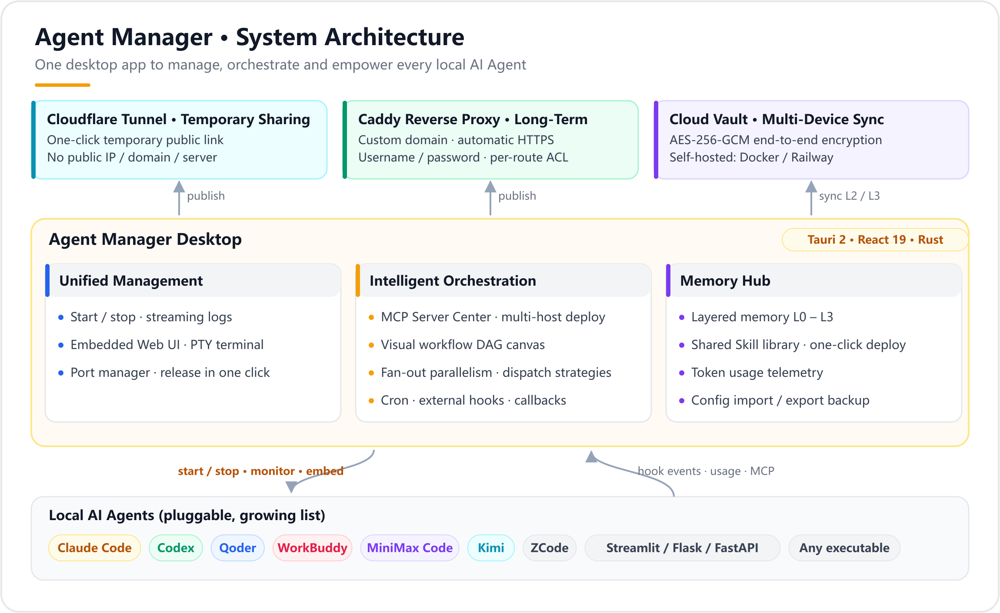
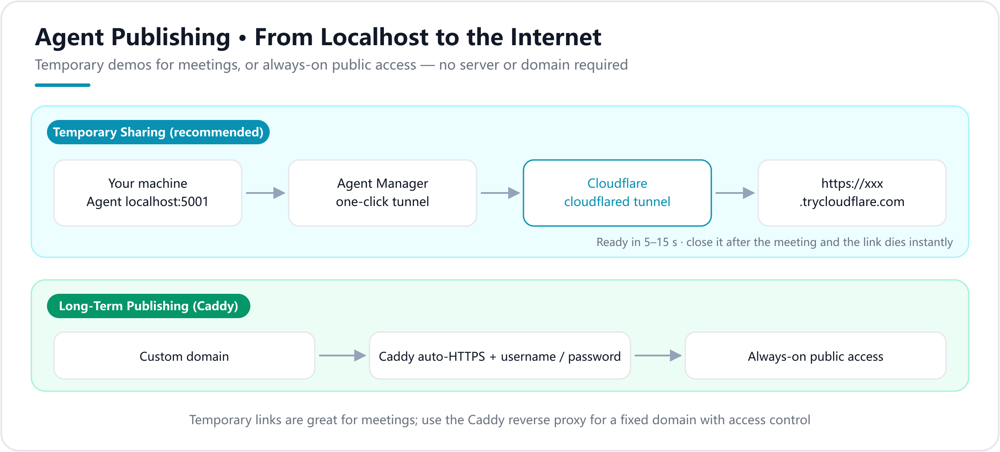
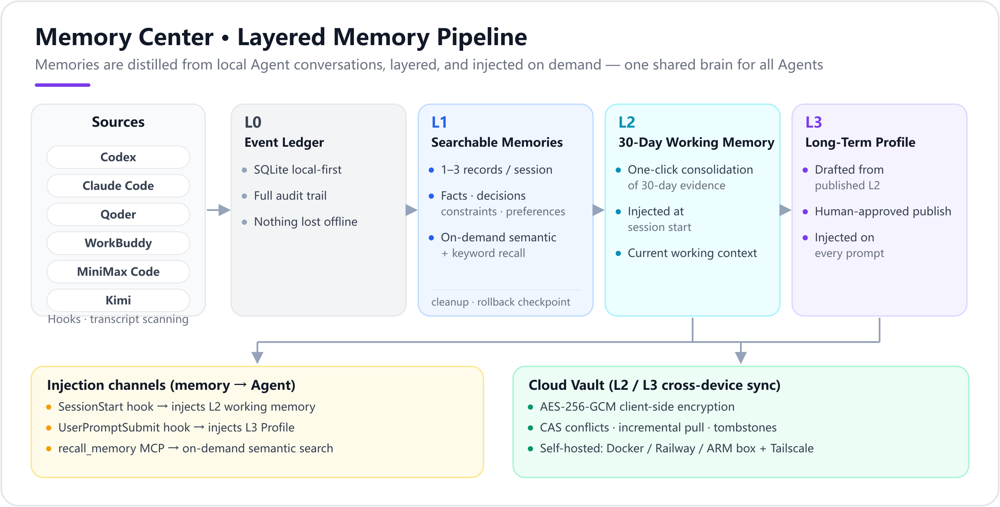

# Agent Manager

<p align="center">
  
</p>

<p align="right"><a href="./README.md">中文</a></p>


[](https://github.com/Zafer-Liu/Agent_Manager/stargazers)
[](https://github.com/Zafer-Liu/Agent_Manager/actions)
[](#)
[](https://tauri.app)
[](https://react.dev)
[](https://www.rust-lang.org)

> A unified local management center for AI Agents.
> After adding your Agents, you can:
>
> - Start and stop Agents with one click, with real-time logs, embedded Web UIs and interactive terminals
> - Share one layered memory across Agents — a single brain for all of them
> - Generate temporary public sharing links with one click

<p align="center">
  <a href="#features">✨ Highlights</a> ·
  <a href="#recommended-agents">🤝 Recommended</a> ·
  <a href="#install">⚙️ Installation</a> ·
  <a href="#quickstart">🚀 Quick Start</a> ·
  <a href="#llm-config">🤖 LLM Config</a> ·
  <a href="#memory">🧬 Memory Center</a> ·
  <a href="#share">🌐 Share Agents</a> ·
  <a href="#faq">❓ FAQ</a>
</p>

<details>
<summary><strong>📚 Full Table of Contents</strong></summary>

<br>

- [Highlights](#features)
- [Recommended Agent](#recommended-agents)
- [Core Capabilities](#capabilities)
  - [Agent Management](#agents)
  - [MCP Server Center](#mcp)
  - [Agent Publishing and Temporary Sharing](#share)
  - [Port Manager](#ports)
  - [Memory Center — Cross-Agent Layered Memory](#memory)
- [Installation](#install)
- [Quick Start](#quickstart)
- [LLM Configuration](#llm-config)
- [Supported Project Types](#project-types)
- [Data Storage Paths](#data-paths)
- [Telemetry and External Integration](#telemetry)
- [Roadmap and Changelog](#roadmap)
- [FAQ](#faq)
- [Contributing](#contributing)
- [License](#license)

</details>

---

<a id="features"></a>

# ✨ Highlights

**Agent Manager** is a desktop application built with Tauri 2, React 19 and Rust. It is designed to solve a common problem: once you run multiple AI Agents locally, managing them quickly becomes messy.

Core idea: **manage all Agents from one window.**

<p align="center">
  
</p>

- No need to keep multiple terminals open, or remember different startup commands
- No need to manually open browser tabs and search for ports
- Control every Agent through natural language
- Let all your coding Agents share one layered memory and one Skill library
- Publish an Agent to the public internet for a demo in one click

---

<a id="recommended-agents"></a>

# 🤝 Recommended Agent

Agent Manager can centrally manage various locally running AI Agents.
If you're looking for a business-oriented Agent to host under Agent Manager, we recommend:

<details>
<summary><strong>📊 Smart Business Analytics Agent</strong></summary>

<br>

**Smart Business Analytics Agent** is an AI Agent for business data analysis scenarios.
After uploading Excel/CSV files or connecting a database, users can ask questions in natural language. The system automatically handles:

* Data structure recognition
* SQL generation and execution
* Chart recommendation and generation
* Business insight analysis
* Excel / Word / PPT report export

When used together with Agent Manager, you get a more complete desktop experience:

| Scenario | Agent Manager provides |
|----------|----------------------|
| Start the Analytics Agent | One-click start / stop process |
| Monitor runtime status | Real-time logs, PID, port status |
| Open the analytics interface | Embedded Web UI, no browser switching |
| Temporary team demos | One-click Cloudflare Tunnel public link |
| Multi-Agent collaboration | Visual workflow orchestration · cron / external triggers |

👉 Project: [Smart Business Analytics Agent](https://github.com/Zafer-Liu/Data-Analysis-Agent)

</details>

---

<a id="capabilities"></a>

# 🧠 Core Capabilities

<a id="agents"></a>

## 1️⃣ Agent Management

### Automatic Project Type Detection

After you select a project directory, Agent Manager detects the project type and fills in the startup command automatically. See [Supported Project Types](#project-types) for details.

### Start and Monitor


- Start / stop Agent processes with one click
- Stream real-time logs from stdout and stderr, with auto-scroll support
- View PID, port status, and startup time
- Drag and reorder Agents in the sidebar

### Embedded Web UI


Agents with Web UIs, such as Streamlit, Flask, and FastAPI projects, can be opened directly inside the app. You no longer need to switch back and forth between browsers.

- Open multiple Agent UIs in tabs
- Resize the tab bar height by dragging
- Enter full-screen mode with one click
- Automatically fill WebSocket tokens for OpenClaw-type Agents

---

<a id="mcp"></a>

## 2️⃣ MCP Server Center — Unified Management and Deploy

Manage local MCP servers in one place: they are both the **runtime configuration available to workflows** and the **catalog deployed into agent hosts**.

**Local server management:**

- **Local scan:** automatically detects globally installed npm MCP packages
- **Smart parsing:** paste any text — official docs, install instructions — and AI extracts the configuration
- **Manual setup:** enter stdio / SSE configuration manually
- Servers added here are directly callable from [visual workflows](#roadmap)

**Catalog & deploy:**

- Keep frequently used MCP servers as catalog entries and install them with one click into hosts such as Claude Code, Claude Desktop, Codex CLI, Codex Desktop, Qoder, WorkBuddy, MiniMax Code, Kimi and ZCode
- Import existing server configs from your agents in one click, with live install status (installed / differs)

---

<a id="share"></a>

## 3️⃣ Agent Publishing — Temporary Sharing and Public Access

No fixed IP, domain name, or server is required. Two paths take a local Agent onto the internet:

<p align="center">
  
</p>

### 🔗 Temporary Sharing — Recommended for Meetings


Generate a temporary public link with one click:

```text
Your local computer localhost:5001
        ↓ Cloudflare Tunnel
https://abc-xyz.trycloudflare.com  ← Share this with teammates
```

**Workflow:**

1. Install cloudflared, as shown below
2. Make sure the target Agent is running
3. Go to the **Agent Publishing** page, find the target Agent, then click **Generate Link**
4. Wait about 5–15 seconds until `https://xxx.trycloudflare.com` appears
5. Copy the link and send it to teammates
6. Click **Close** after the meeting, and the link becomes invalid immediately

**Install cloudflared:**

```powershell
# Windows, recommended with Scoop
scoop install cloudflared

# macOS
brew install cloudflared
```

You can also download the executable directly from [GitHub Releases](https://github.com/cloudflare/cloudflared/releases/latest).

> ⚠️ Temporary links do not include access control. Open them only when needed and close them immediately after use.

### 🛡️ Caddy Reverse Proxy — Long-Term Publishing

This is suitable when you need a fixed domain name and persistent public access.

- Bind a custom domain with automatic HTTPS certificates
- Add username / password access control with bcrypt-encrypted storage
- Manage fine-grained multi-user permissions, with independent access rules for each route
- Generate a Caddyfile and start or reload Caddy with one click

---

<a id="ports"></a>

## 4️⃣ Port Manager


View all ports currently listening on your machine.

- Display port number, protocol, PID, and process name
- Kill the process occupying a specific port with one click
- Quickly troubleshoot Agent startup failures caused by port conflicts

---

<a id="memory"></a>

## 5️⃣ Memory Center — Cross-Agent Layered Memory

Let every Agent remember your preferences, decisions and current focus. The Memory Center extracts memories from your local coding agents automatically, organizes them in layers and injects them back into new sessions — **one shared brain for all your agents**.

<p align="center">
  
</p>

### 🧬 Four-layer memory model (L0–L3)

| Layer | Name | Source | Role |
|-------|------|--------|------|
| L0 | Event ledger | Raw hook events / local transcript scans | Audit source, never injected wholesale |
| L1 | Searchable memories | The model extracts 1–3 facts / decisions / constraints / preferences per completed conversation | On-demand semantic + keyword recall |
| L2 | 30-day working memory | One-click consolidation of recent L1 evidence | Injected once when a conversation starts |
| L3 | Long-term Profile | Drafted from L2, injected only after human approval | Stable preferences and constraints injected on every prompt |

### 📥 Automatic collection (Agent → memory)

- Supports **Codex, Claude Code, Qoder, WorkBuddy, MiniMax Code and Kimi** via hooks or local transcript scanning
- Conversations land in a local SQLite ledger first and are extracted asynchronously — nothing is lost offline, and failed sessions can be retried manually
- The **Pending Memories** and **Organized Conversations** panels let you review full conversations, extraction progress and failure reasons at any time
- L1 cleanup and deduplication: local BGE semantic candidates + LLM adjudication, with a restorable rollback checkpoint

### ✍️ Custom memories

- Hand-write memories under either the working-memory or the long-term-Profile card; **the two layers are fully independent**, each with its own list, edit and delete
- Always delivered with consolidation and injection; only you can edit or delete them — automatic cleanup never touches them

### 💉 Memory injection (memory → Agent, two channels)

| Channel | How it works | Best for |
|---------|--------------|----------|
| Automatic Hook injection | SessionStart injects only L2; every UserPromptSubmit injects only L3 | Working context at startup, durable preferences on every turn |
| Shared memory MCP | Agents call `recall_memory` for on-demand semantic search | Task-scoped retrieval with bounded context size |

**One-click onboarding:** the Memory Center installs or uninstalls the shared-memory MCP for **nine hosts** — Claude Code, Claude Desktop, Codex CLI, Codex Desktop, Qoder, WorkBuddy, MiniMax Code, Kimi and ZCode — and manages collection / injection hooks for the four hook-capable agents (Claude Code, Codex, Qoder, WorkBuddy). Per-device data-directory overrides are supported.

### ☁️ Cloud Vault — cross-device sync (optional)

- Sync scope: published L2 / L3 documents plus user-defined memories, so every device shares the same brain
- **AES-256-GCM end-to-end encryption:** the key is derived from your sync password and never stored; the server only holds ciphertext and understands nothing
- CAS conflict detection, incremental pull, tombstone deletes; the local SQLite database always stays authoritative — being offline never affects injection
- Single-binary server, open-sourced under [`vault/`](vault/README.md): self-host with Docker, Railway, or an ARM board + Tailscale

### 📊 Token usage & shared Skills

- **Usage analytics:** aggregates real input / output / cache usage from each agent's local transcripts, aligned with provider billing
- **Skill library:** collects each agent's `SKILL.md` into a shared library, previews new / updated / conflicting entries by content hash before syncing; "publish + assign" completes in one step, with bulk operations and per-agent drift detection

> For external integration and the telemetry endpoint format, see [Telemetry and External Integration](#telemetry).

---

<a id="install"></a>

# ⚙️ Installation

### Download Prebuilt Installers — Recommended

Download the latest version from [Releases](https://github.com/Zafer-Liu/Agent_Manager/releases) (a Windows x64 installer is provided today; macOS support is coming soon).

Double-click the installer and follow the prompts.

### Build from Source

**Prerequisites:**

- [Node.js](https://nodejs.org) 18 or later
- [Rust](https://rustup.rs), stable toolchain
- [Tauri prerequisites](https://tauri.app/start/prerequisites/), including Visual Studio C++ Build Tools on Windows

```bash
git clone https://github.com/Zafer-Liu/Agent_Manager.git
cd Agent_Manager

# Install dependencies
npm install
cd frontend && npm install && cd ..

# Run in development mode
npm run dev

# Build for production
npm run build
```

Build outputs are located in `src-tauri/target/release/bundle/`.

---

<a id="quickstart"></a>

# 🚀 Quick Start

## Step 1: Add an Agent

1. Click **Agents** in the sidebar, then click **+ New Agent** in the top-right corner
2. Click 📁 to select the Agent project directory (or switch to the **Install from GitHub** tab to pull a repository directly)
3. Agent Manager detects the project type and fills in the startup command automatically
4. Enter a name and confirm the port number, if the Agent has a Web UI, then click **Save**
5. Click ▶ to start the Agent

## Step 2: View the Agent Interface

- For Agents with Web UIs, such as Streamlit or Flask: click **Open UI** to open it inside an embedded tab
- For TUI Agents, such as Claude Code: click **Open Terminal** to open an embedded terminal

## Step 3: Turn On the Memory Center (Optional)

1. In **Settings → LLM and memory extraction**, confirm the memory extraction model (an Ollama local model works too)
2. Open the **Memory Center** and install hooks for Codex / Claude Code etc. under **Automatic collection**
3. Use your Agents as usual — memories settle automatically; generate and inject the **30-day working memory** and **long-term Profile** with one click

## Step 4: Share an Agent During Meetings (Optional)

1. Install cloudflared
2. Open the **Agent Publishing** page
3. Find the target Agent, click **Generate Link**, then copy and share the link

---

<a id="llm-config"></a>

# 🤖 LLM Configuration

MCP deploy and memory extraction rely on an LLM. Add one in **Settings → LLM and memory extraction**:

| Field | Description | Example |
|-------|-------------|---------|
| Name | Custom display name | DeepSeek |
| Base URL | OpenAI-compatible API endpoint | `https://api.deepseek.com/v1` |
| API Key | API key for the provider | `sk-xxx` |
| Model | Model name | `deepseek-chat` |

Click **Test Connection**. A green status means the configuration is valid.

**Built-in provider presets:**

| Provider | Base URL | Recommended model |
|----------|----------|-------------------|
| DeepSeek | `https://api.deepseek.com/v1` | `deepseek-chat` |
| OpenAI | `https://api.openai.com/v1` | `gpt-4o-mini` |
| Any compatible API | Custom | Custom |

**Local models (Ollama):**

The LLM Settings page includes a built-in **Ollama Local Models** module:

1. Make sure Ollama is running locally (default `http://localhost:11434`, configurable)
2. Click **Test Connection** to list the pulled local models (parameter size / quantization / disk size)
3. Click **Add** on a model to register it as a custom provider automatically — ready to test or set as the memory extraction model

---

<a id="project-types"></a>

# 🔍 Supported Project Types

After you select a project directory, Agent Manager detects and fills in the following configurations automatically:

| Project type | Detection condition | Auto-generated command |
|--------------|---------------------|------------------------|
| Python · uv | `pyproject.toml` + `uv.lock` | `uv run python main.py` |
| Python · FastAPI | requirements contains `fastapi` | `uvicorn main:app --reload --port PORT` |
| Python · Django | `manage.py` exists | `python manage.py runserver 0.0.0.0:8000` |
| Python · Streamlit | requirements contains `streamlit` | `streamlit run app.py --server.port 8501` |
| Python · Flask | requirements contains `flask` | `python app.py` |
| Python · Generic | `main.py`, `app.py`, or similar files | `python main.py` |
| Node.js | `package.json` | `npm run dev` |
| Rust | `Cargo.toml` | `cargo run` |
| Go | `go.mod` | `go run .` |
| npm global command | `%APPDATA%\npm\*.cmd` | Interactive PowerShell + automatic command input |
| Executable file | `.exe`, `.bat`, `.cmd`, `.sh` | Run directly |

Port numbers are also detected automatically by scanning `.env` files, `pyproject.toml` scripts, and `port=` configurations in source code.

---

<a id="data-paths"></a>

# 📁 Data Storage Paths

| Data | Windows | macOS |
|------|---------|-------|
| Agent configuration | `%APPDATA%\agent-manager\agents.json` | `~/Library/Application Support/agent-manager/agents.json` |
| LLM providers | `%APPDATA%\agent-manager\llm_config.json` | Same as Windows |
| Proxy / user configuration | `%APPDATA%\agent-manager\proxy.json` | Same as Windows |
| Memory & telemetry database | `%APPDATA%\agent-manager\telemetry.sqlite3` | Same as Windows |
| Agent source directory overrides | `%APPDATA%\agent-manager\agent_source_paths.json` | Same as Windows |
| Generated Caddyfile | `%APPDATA%\agent-manager\Caddyfile` | Same as Windows |
| MCP server configuration | `%APPDATA%\Claude\claude_desktop_config.json` | `~/Library/Application Support/Claude/claude_desktop_config.json` |

The Settings page offers one-click **configuration export / import** for migration and disaster recovery.

---

<a id="telemetry"></a>

# 🔌 Telemetry and External Integration (Experimental)

The memory pipeline uses a local SQLite database as its event ledger: hook events are persisted first and extracted asynchronously, so nothing is lost while the memory service is offline.

- **Codex, Claude Code, Qoder:** install / uninstall local hooks from the Memory Center; the port and auth token follow the **External Triggers** settings
- **WorkBuddy:** Agent Manager never writes into its Claude Code configuration to avoid duplicate collection; aggregated session / usage data can be submitted through the standard telemetry endpoint
- **Token accounting:** Codex, Claude and WorkBuddy read real usage from local transcripts; where Qoder / MiniMax Code / Kimi transcripts do not expose complete provider usage, clearly marked local estimates are shown. Scattered hook events are kept as audit records only and never double-counted; adapters may use `session_usage` to override estimates with real final values

Standard telemetry endpoint: `POST http://127.0.0.1:<hook-port>/telemetry/events/{codex|workbuddy|claude|qoder}`.

```json
{
  "session_id": "stable-session-id",
  "event": "session_usage",
  "cwd": "D:/Github-repo/example",
  "usage": { "input_tokens": 120, "output_tokens": 48, "cached_tokens": 60 },
  "usage_scope": "session"
}
```

`input_tokens` must be the full input total for the session; `cached_tokens` is display-only detail for cache hits (do not add it to `input_tokens` or the token total). Later reports for the same `source + session_id` overwrite the previous values instead of accumulating.

---

<a id="roadmap"></a>

# 🗺️ Roadmap and Changelog

> **Current version `v1.0.0 Beta`**

## Major Updates in v1.0.0 Beta

**🧬 Memory Center — cross-Agent layered memory (core of this release)**

- ✅ **Four-layer memory model (L0–L3):** event ledger → searchable memories → 30-day working memory → long-term Profile, with a human publish gate and editable drafts
- ✅ **Automatic collection:** Codex, Claude Code, Qoder, WorkBuddy, MiniMax Code and Kimi, via hooks or local transcript scanning; a SQLite ledger persists everything first, so nothing is lost offline
- ✅ **Two injection channels:** SessionStart injects L2, UserPromptSubmit injects L3 on every prompt; the shared-memory MCP `recall_memory` covers on-demand semantic search
- ✅ **Shared-memory MCP onboarding for nine hosts:** Claude Code / Claude Desktop / Codex CLI / Codex Desktop / Qoder / WorkBuddy / MiniMax Code / Kimi / ZCode
- ✅ **Cleanup & deduplication:** chunked local BGE candidate generation with an adaptive LLM adjudication budget; rollback checkpoints keep deletions safe
- ✅ **Dedicated panels:** Pending Memories, Organized Conversations, and Memory Injection (two-direction view with audit replay)
- ✅ **Cloud Vault:** cross-device sync of L2 / L3 and custom memories with AES-256-GCM end-to-end encryption and a self-hosted server ([vault/](vault/README.md); Docker / Railway / ARM board)
- ✅ **Shared Skill library:** scans each agent's `SKILL.md`, one-step "publish + assign", bulk operations and per-agent drift detection
- ✅ **Token usage analytics:** real input / output / cache usage read from local transcripts, aligned with provider billing

**⚙️ Management & experience**

- ✅ **Ollama local models:** lists pulled models automatically; one click to register as a custom provider or the memory extraction model
- ✅ **MCP Server Center:** manage MCP servers as a central catalog with one-click multi-host deploy
- ✅ **Config export / import backup:** one-click migration and recovery
- ✅ **Install Agents from GitHub:** paste a repository URL and the form fills itself

📖 [View Full Changelog](https://github.com/Zafer-Liu/Agent_Manager/releases)

---

## Major Updates in v0.3.0

**Phase four: external collaboration**

- ✅ **Local Hook Server:** default `127.0.0.1:9420`; external systems push tasks into Agent Manager over HTTP, with a configurable port and auth token
- ✅ **agent_task node:** workflows can schedule local / remote sub-Agents and wait on a oneshot channel
- ✅ **Callback notifications:** outbound webhooks on run completion, with exponential-backoff retries (3 attempts)
- ✅ **Fan-out parallel execution:** static / by_field / llm_split split strategies, joined with `join_all`
- ✅ **DispatchStrategy:** Fixed / Failover / CapabilityMatch / Random
- ✅ **Cron scheduling:** a self-built 5-field cron parser checked every minute by a background thread
- ✅ **McpTransport Http variant:** remote MCP servers over Streamable HTTP
- ✅ **SVG DAG canvas:** drag-and-drop positioning with a node toolbar
- ✅ **ExternalTriggers settings page**, run-history trigger-source column, workflow acceptance panel, sweeper self-healing, failure-trace diagnostics, and a metrics event source

📖 [View Full Changelog](https://github.com/Zafer-Liu/Agent_Manager/releases)

---

## Major Updates in v0.2.3

- ✅ Visual workflows: compose MCP tools, LLM steps, and complete MCP Agent nodes with streamed step feedback
- ✅ Enhanced MCP Agent: enable multiple MCP servers per conversation and inspect collapsible tool-call steps
- ✅ Smart MCP configuration: scan local packages or parse JSON, README text, commands, and stdio/SSE settings with AI
- ✅ Chinese and English UI: full i18n support and an in-app language switcher
- ✅ Continuous integration: frontend checks and Rust tests for pushes, pull requests, and releases

📖 [View Full Changelog](https://github.com/Zafer-Liu/Agent_Manager/releases)

---

<a id="faq"></a>

# ❓ FAQ

<details>
<summary><b>🧬 Memory Center</b></summary>

<br>

<details>
<summary><b>Conversations never get extracted into memories.</b></summary>

Check the following, in order:

1. Extraction depends on an LLM: make sure at least one provider passes **Test Connection** in **Settings → LLM and memory extraction** (or an Ollama local model is connected)
2. Open the **Memory Center → Pending Memories** panel to see whether the session is queued and what the failure reason is
3. Confirm the agent's hook is installed (collection shows "hooks installed"), or that its transcript directory is detected correctly — scan-type agents rely on directory discovery
4. Failed sessions can be retried manually from the panel

</details>

<details>
<summary><b>My L3 Profile edits never take effect.</b></summary>

L3 uses a draft → human-publish gate: drafts generated from L2 must be confirmed with **Publish** before they are injected. A published L3 can also be edited directly; changes apply immediately. If MCP retrieval still returns old content, check that the host's shared-memory MCP is connected.

</details>

<details>
<summary><b>What happens when the Cloud Vault reports a sync conflict?</b></summary>

The local SQLite database is always authoritative, and being offline never affects injection. On conflict the app shows a dialog and you choose which side to keep; the server only stores AES-256-GCM ciphertext and can neither read nor tamper with content.

</details>

</details>

---

<details>
<summary><b>📦 Agent Management</b></summary>

<br>

<details>
<summary><b>The Agent status shows "Error" after startup.</b></summary>

Open the Agent detail page and check the logs. Common causes include:

- Port conflict: use Port Manager to find and kill the process occupying the port
- Missing dependencies: run the startup command manually in a terminal to see the exact error
- Incorrect working directory: check whether the working directory in the Agent configuration is correct

</details>

<details>
<summary><b>The Agent has a Web UI, but the page is blank after opening it.</b></summary>

The Agent may still be starting and the port may not be listening yet. Wait a few seconds, then click the refresh button in the UI panel toolbar.

</details>

<details>
<summary><b>The Claude Code terminal is blank after opening.</b></summary>

This is normal. The app automatically starts PowerShell, waits about 800 ms, and then writes the `claude` command to stdin. Wait another 1–2 seconds and the Claude Code TUI should render.

</details>

<details>
<summary><b>The detected command for my Python Agent is incorrect.</b></summary>

Automatic detection is based on file scanning, so edge cases can be misclassified. You can manually edit the command and arguments in the Agent edit screen. Saved changes take effect immediately.

</details>

<details>
<summary><b>Can I reorder the Agent list?</b></summary>

Yes. On the Agents page, hover over an Agent, hold the drag handle on the left, shown as the ⠿ icon, and drag it to the desired position. The order is saved automatically.

</details>

</details>

---

<details>
<summary><b>🌐 Agent Publishing</b></summary>

<br>

<details>
<summary><b>No URL appears after I click "Generate Link".</b></summary>

Possible causes:

1. cloudflared is not installed or is not in PATH. Click the **Rescan** button and make sure the path is detected
2. Network issue. cloudflared needs access to Cloudflare, so check proxy and firewall settings
3. The Agent is not running. Temporary links forward traffic to a local port, so the Agent must be running

</details>

<details>
<summary><b>My teammate opens the link but sees "This site can’t be reached".</b></summary>

Check the following:

1. The Agent is running on your local machine
2. The tunnel is still open and the app still shows a green URL
3. The link is complete and follows the `https://xxx.trycloudflare.com` format

</details>

<details>
<summary><b>Multiple teammates access the Agent at the same time, and conversations are mixed together.</b></summary>

This is a limitation of the Agent itself. Conversation history is stored inside the Agent process memory, and Agent Manager cannot isolate it externally.

If isolation is required, session support must be added to the Agent code. For example, Streamlit naturally supports per-session state through `st.session_state`.

</details>

<details>
<summary><b>Caddy cannot be found, or proxy_apply fails.</b></summary>

Install Caddy:

```powershell
# Windows
scoop install caddy

# macOS
brew install caddy
```

After installation, click the refresh button on the Agent Publishing page.

</details>

</details>

---

<details>
<summary><b>⚙️ Installation and Runtime</b></summary>

<br>

<details>
<summary><b>Windows shows an "Unknown Publisher" warning during installation.</b></summary>

Click **More info**, then click **Run anyway**. This happens because the installer is not signed with a Microsoft code-signing certificate.

</details>

<details>
<summary><b>macOS says the app cannot be opened because the developer cannot be verified.</b></summary>

Run the following command in Terminal:

```bash
xattr -d com.apple.quarantine /Applications/智管-Agent\ Manager.app
```

Alternatively, right-click the app, choose **Open**, and then click **Open** again.

</details>

<details>
<summary><b>`npm run dev` reports that the development port is already in use.</b></summary>

This project uses development port **1420** to avoid conflicts with Mindmap and other Vite projects that commonly use 5173. If port 1420 is occupied:

```powershell
# Find the process occupying the port
netstat -ano | findstr :1420

# Kill the process. Replace <PID> with the actual PID
taskkill /PID <PID> /F
```

</details>

</details>

---

<a id="contributing"></a>

# 🤝 Contributing

PRs and Issues are welcome! Here's how to get involved:

1. **Fork** this repository
2. Create a feature branch (`git checkout -b feature/amazing-feature`)
3. Commit your changes (`git commit -m 'feat: add amazing-feature'`)
4. Push to the branch (`git push origin feature/amazing-feature`)
5. Open a **Pull Request**

For bug reports or feature requests, please use [Issues](https://github.com/Zafer-Liu/Agent_Manager/issues). See [Build from Source](#install) for dev environment setup.

---

<a id="license"></a>

# 📄 License

[Apache 2.0](LICENSE)

---

# ⭐ Project Goal

Let Agent Manager handle every Agent, so you can spend your time on what truly matters.
